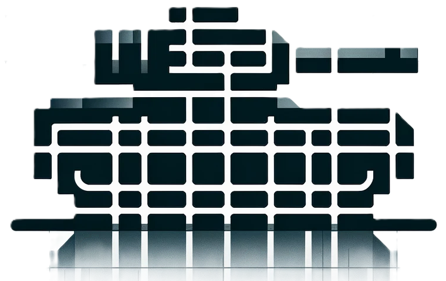
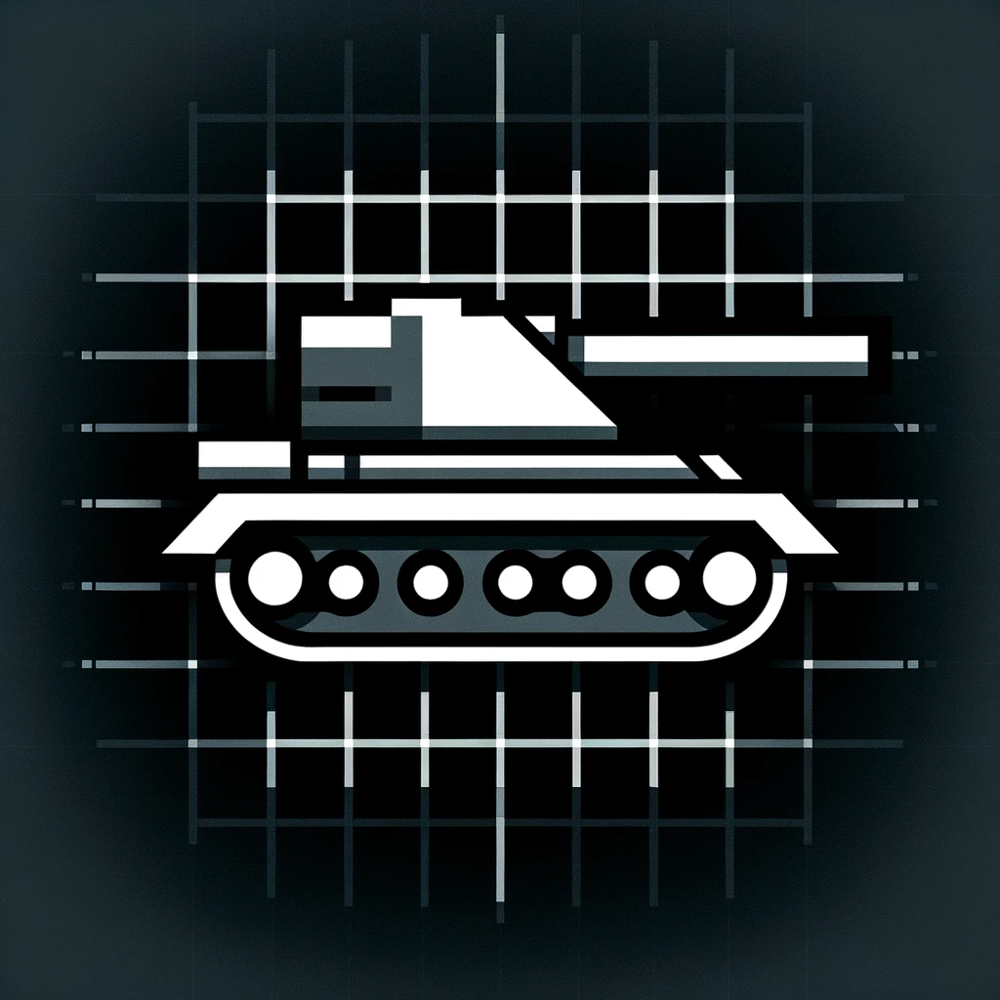
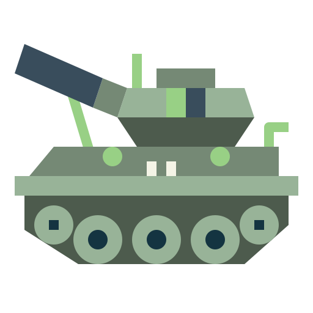

# Attributions

<!-- |  |  |  This is a section  -->

## Icons
All the icons used on this project are from [Flaticon](https://www.flaticon.com/) or generated using [DALL·E](https://openai.com/dall-e/).
| Description (Link) | Icon |
| ---- | ---- |
| [Tank Icon](./icons/tank_icon.png) | 
| [Tank Icon 2](./icons/tank_icon2.png) | 
|  |  |
| [Tank](https://www.flaticon.com/free-icon/tank_3111484) | 

## 3d Models
All the 3d models used on this project are from [PolyPizza](https://poly.pizza/).
| Model | Link |
| ---- | ---- |
| [RailGun Tank](./models/railgun_tank.glb) | [Tank](https://poly.pizza/m/YWSyTmvGI2) by Zayn [CC-BY](https://creativecommons.org/licenses/by/3.0/) |
| [Warfare Tank](./models/warfare_tank.glb) | [Tank](https://poly.pizza/m/egcLMSGiuA) by KolosStudios [CC-BY](https://creativecommons.org/licenses/by/3.0/) |
| [Tank](./models/tank.glb) | [Tank](https://poly.pizza/m/uYHpj7lz1J) by [Quaternius](https://quaternius.itch.io/) |

## Sounds
The sound used on this project are still on a discussion about the main source. So, for now the project has no sound.